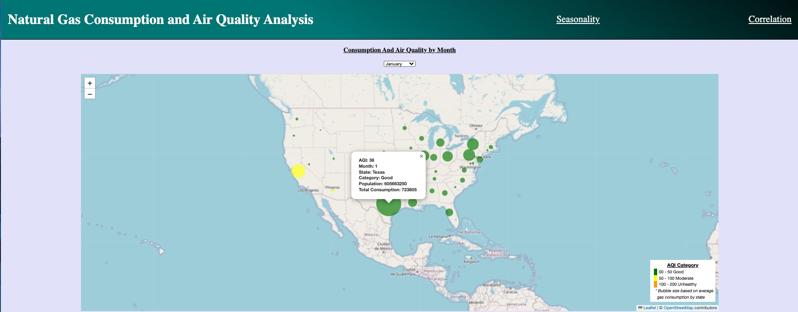
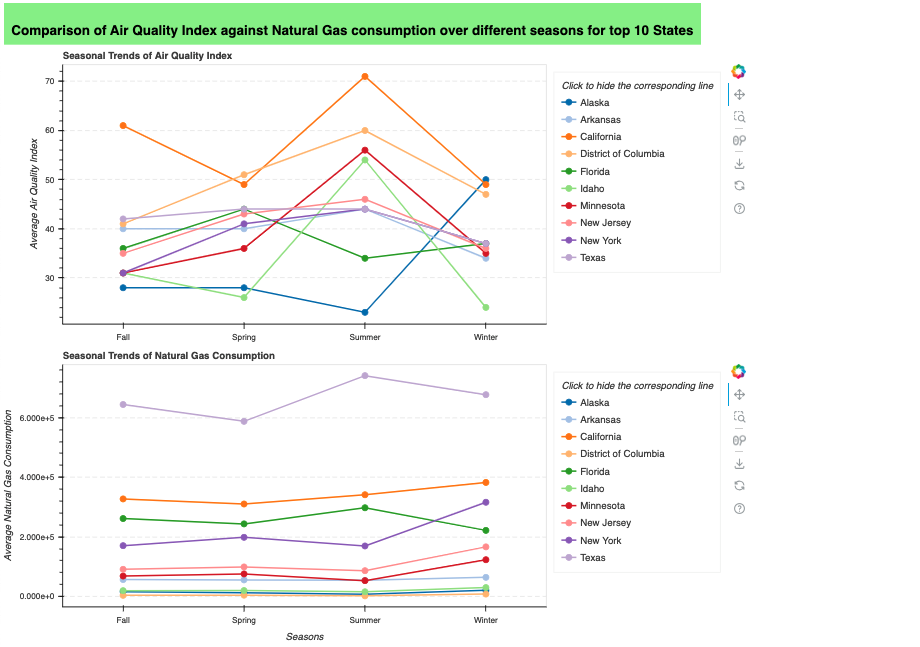
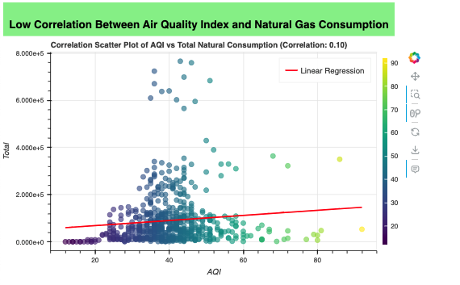

# Project-3

## Website: 
[website](https://github.com/JenniferVasquez1/Project-3)

## Description
Analyze natural gas and air quality data to find correlation

### Seasonal Analysis

### Natural Gas Consumption & AQI Correlation

## Table of Contents
- [Installation](#installation)
- [Usage](#usage)
- [Credits](#credits)
- [License](#license)
- [Features](#features)

- [Contact](#contact)

## Installation
Jupyter notebook, JavaScript, HTML, CSS, Python, Leaflet, D3, Sqlite3, Bokeh, Flask, Pandas

## Usage
Run flask to activate server pages

## References
Source: https://www.kaggle.com/datasets/alistairking/natural-gas-usage, https://www.kaggle.com/datasets/calebreigada/us-air-quality-1980present

## Credits
Jennifer Harris, Sadaf Hakim, Leo Crowal

## License
MIT

## Features
Interactive charts, Scatter Plot and Map

## Contact
If there are any questions or concerns, I can be reached at:
##### [github: JenniferVasquez1](https://github.com/JenniferVasquez1)
##### [email: jennifer.v.harris@outlook.com](mailto:jennifer.v.harris@outlook.com)
##### [email: sadafhakim@yahoo.com](mailto:sadafhakim@yahoo.com)
##### [email: lcrowal@icloud.com](mailto:lcrowal@icloud.com)
